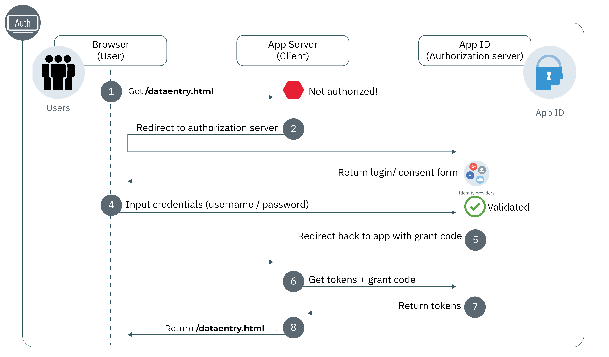
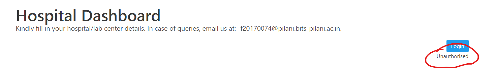
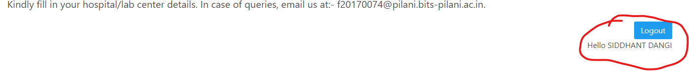
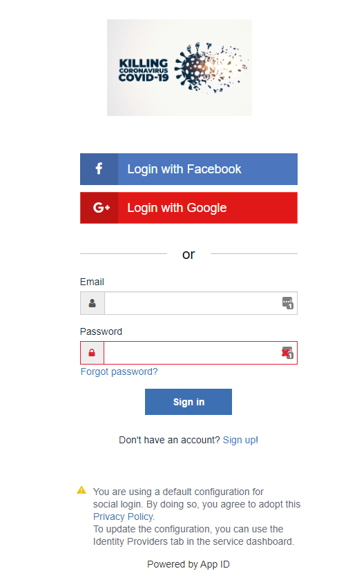
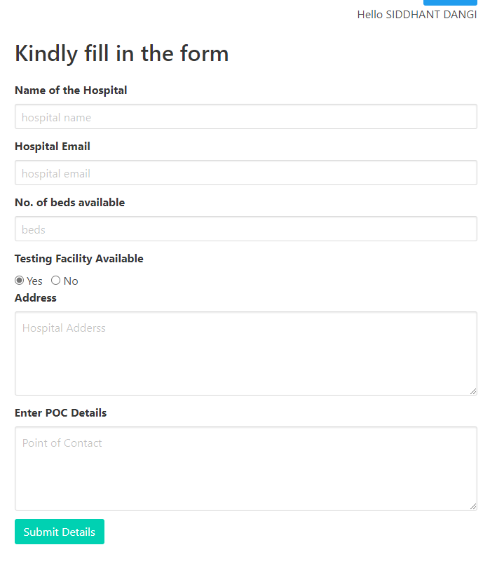
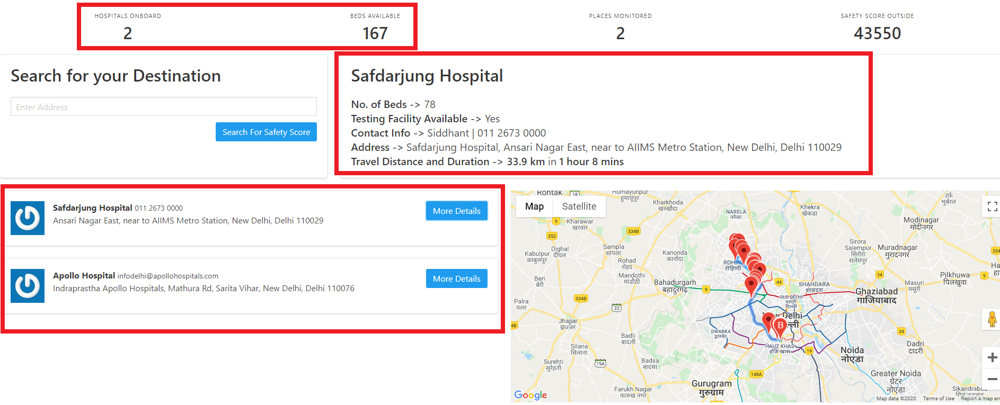
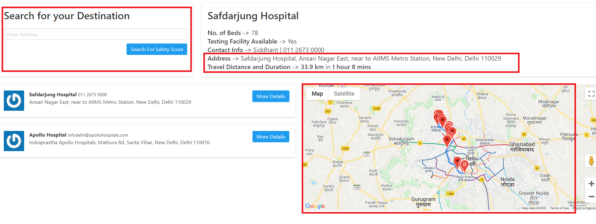
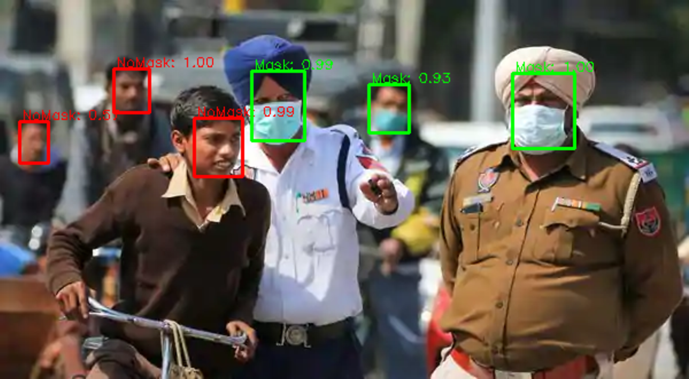

# TEAM REGRESSION
 
 IBM Crack the COVID Hackathon

## Authors
 - [Siddhant Dangi](https://www.linkedin.com/in/siddhant-dangi-8b9707153/)
 - [Jivat Neet Kaur](https://www.linkedin.com/in/jivat-neet-14a4b0187)
 - [Honnesh Rohmetra](https://www.linkedin.com/in/honnesh-rohmetra/)
 - [Abhishek Agarwal](https://www.linkedin.com/in/abhishek-agarwal-003623166/)
          
## Contents
1. [Overview](#overview)
2. [Video](#video)
3. [The idea](#the-idea)
4. [How it works](#how-it-works)
5. [Documents](#documents)
6. [Datasets](#datasets)
7. [Technology](#technology)
8. [Running the App](#running-the-app)
9.  [Getting started](#getting-started)
10. [License](#license)

## Overview

### What's the problem?

In times of crisis, there are multiple issues which affect the community and we're trying to solve a few of them. As the number of Covid-19 cases will continue to rise, the number of people seeking treatment will overwhelm many hospitals. Having a handle on local hospitals’ capacity and resource availability could help balance the load of Covid-19 patients requiring hospitalization across a region by allowing medical staff to send a patient to a facility where they are more likely to be treated quickly. But many states lack real-time data on their current capacity to treat Covid-19 patients. 

Another issue we'll be witnessing with the relaxation of lockdown restrictions is when people will be stepping out to go to work, purchase essentials and carry out other activities. But, normalcy has not returned and the hesitation and fear of safety will still affect people when they think about stepping out. A live monitoring of the safety status of locations around people will help manage crowd and the safety scenario in an efficient manner.

### How can technology help?

Technological advancement with a blend of machine learning, software development and connectivity through applications can equip the mankind with abilities to fare through this pandemic in a safer and smarter way. 

A web application can help all - those have been affected as well as those who haven't been yet - by providing essential statistics and services that can make them aware of current scenario at different locations and aid them in selecting the best possible treatment available within their financial and personal constraints.
(**Add about IBM services used in brief**)

## Video

### IBM Hackathon video script

**Problem Description:**
As the number of Covid-19 cases will continue to rise, the number of people seeking treatment will overwhelm hospitals. Often the treatment centers have no availability of beds and are already working at full capacity, which leads to inefficiency and confusion in communication while admitting patients to these treatment centres, leading to a risk of life. Having a handle on local hospitals’ capacity and resource availability could help balance the load of Covid-19 patients who are requiring hospitalization by sending a patient to a facility where they are more likely to be treated quickly. But there is no unified platform with real-time data on the current capacity and resources to treat Covid-19 patients.

Another issue we'll be witnessing with the relaxation of lockdown restrictions is when people will be stepping out to go to work, purchase essentials and carry out other activities. But, normalcy has not returned and the hesitation and fear of safety will still affect people when they think about stepping out. A live monitoring of the safety status of locations around people will help manage crowd and the safety scenario in an efficient manner.

**Solution:**
To address the need of a real-time tracking system for Covid-19 beds and hospital resources, our team designed a website with a live Hospital Resource Monitoring Dashboard **[Display the dashboard]**. If you are a patient and need assistance, you can find information regarding nearby hospitals, bed capacity and test availability. If you are a nurse, doctor, health department or state, you can use the Hospital Dashboard Login **[Display the form and real-time updation feature, mention IBM AppID for login]** and share information on the current hospital capacity. **[Details about implementation - using IBM cloudant for the database]** We are using the IBM cloud service Cloudant to design and manage our database for Hospital records.

If you are thinking about stepping out to buy something from the shopping complex or need to get something repaired and are worried about the safety scenario out there, we're tracking the safety score of all the places onboard through their live video camera feed. The video feed is processed every 10 minutes locally and the number of people present and the percentage of people wearing masks is calculated using our mask detection model **[show the model architecture and model results on a video]**. The latitude and longitude of the location, number of people and safety score indicated by the % of people wearing masks is stored in a JSON document. IBM Cloudant database is used to store the location info and corresponding safety scores. If the location info pre-exists on the database, the safety score is simply updated.

The user can view the safety score for their destination location through the search option on our app **[Zoom into 'Search for your destination']**. This allows efficient social distancing management, safety monitoring and will be helpful in avoiding overflow of people in places at any point of time.

The map in tha app displays the route to the destination along with the Travel Distance and duration. **[Focus on map]**
Our solution aims to solve multiple issues posed by the Covid-19 crisis and if the concerned authorities come onboard, it can be resourceful to patients, doctors, emergency medical personnel and all the other users beyond measure. 
 
## The Idea
With the rapid spread of COVID-19 it has become increasingly difficult for the patients who test positive to be accommodated in the treatment centers. Often the treatment centers have no availability of beds and are already working at full capacity, which leads to inefficiency and confusion in communication while transferring patients from a COVID-testing facility to these treatment centres, leading to a risk of life. 

Our application provides a platform for the hospitals to share real-time statistics like number of beds available, presence of testing facilities and number of ventilators which can significantly help the patient reach the required resources as soon as possible.

For those people who have not been not infected yet, the most worrying concern is the ground situation of the places that they are planning to visit. Once the lockdown gets lifted, huge numbers of people would take to the streets and the risk of the uncontrolled spread of virus is unfathomable. 

The application provides the user with a close real-time approximate of the number of people present at any given location, which helps the user make an aware decision. With the help of deep learning, a mask detection model is also integrated with the app which calculates the safety score of a place based on the percentage of people wearing masks, using the live footage from CCTV cameras installed there. This ratio is extremely essential as it gives an idea to the user about the level of risk he/she might take. For publicly crowded places like markets and parks this application is furthermore crucial as the safety score can clearly convey the peril of visiting the place.
(**Add IBM cloudant database being used and other IBM services for this idea**)

## How it works

### Integration of Hospital Monitoring Database with the web app
- Hospital Dashboard Login (Insert screenshot with hospital db login button)

**App ID by IBM** is used to monitor authentication for the login procedure in the app. Only hospitals will be authorised to input data into the form at dataentry.html. If an unauthorised person does so, an alert message shows up and the user is prompted to login. Their input will not be recorded until they are authorised. The workflow for the App ID looks as follows:-

 
The file **app.js** creates an Authentication Strategy based on App ID. On a call to `/appid/login`  it goes on the authentication page, and in case of a success redirects to the `/dataentry.html`. From that page, on a call to `/appid/logout` which is initiated by a click on the logout button, the user is again directed to `/index.html`. A successful login also sends a response via `/api/user` which contains the user's name and the login ID. The username and ID information is also stored along with hospital data to identify the user who filled the data, and hence enable the user to update the records for the same hospital in the future.(Update Feature - Partial Implementation).

 
 
 
  IBM Cloud ID, Login via Google and Login via Facebook have been set as Identity Service Providers.

  
- IBM cloudant for Hospital DB 

Cloudant is used to setup a NoSQL Database which then can be used with a serverless web application. 

The details filled by the hospital post login, are sent to the guestbook database on click of the Submit button.

A GET request is also made to the database to retreve the data which is displayed on the ***Currently Onbaord*** tab of the web app. On clicking the `More Details` button all the information for that hospital is retrieved and is used to for further application.

### Integration of the web app with Google Maps Platform

Based on the user input for a specific location, or by clicking on the More Details button, the location address string is retrieved and sent to the ***Geocoding API***, which finds the lattitude and longitude for the place. Then using the ***Directions API***, the shortest route to the location is found and displayed on the map. The ***Distance Matrix API*** finds the distance and duration of the travel time to reach the destination.

### Mask Detection Model 
- Model Architecture

- Input and Ouput (Image input, extrapolation to video below)
  
The input is given in the form of a live videostream which is processed image frame by frame using OpenCV in Python.
We used the structure of SSD. However, in order to make it run quickly on CCTV camera onboard computer, the backbone network is lite. 

The total model has 1.01M parametes. Input size of the model is 260x260, the backbone network has 8 conv layers. In total, the model has only 24 layers with the location and classification layers counted.
We merge the BatchNormalization to Conv layers in order to accelerate the inference speed.

### Integration of live Video feed and Mask Detection model to predict Safety score (Honnesh + Jivat)

- How model takes video feeds
- Predict score at equally separated frames and return avg safety score

### Integration of location-based Safety score with the Web App app
- Using IBM Cloudant database
Cloudant is used to setup a NoSQL Database which then can be used with a serverless web application. The Python script uploads data points such as no of people in the camera feed, safety score, lattitude and longitude of the camera to the Cloudant mapbook database. The data is retrieved via a GET request, and then based on the user's location entry in the input bar, the database is searched for an entry. If a camera feed is found in the region then the score associated with it is retrieved and then displayed to the user. The web app also keeps a track of the average score in all the places that are being monitored.

## Documents

### Documentation

- [IBM Cloudant Documentation](https://cloud.ibm.com/docs/Cloudant?topic=Cloudant-getting-started-with-cloudant)
- [python-cloudant documentation](https://python-cloudant.readthedocs.io/en/stable/getting_started.html)
- [Watson Studio Documentation](https://dataplatform.cloud.ibm.com/docs/content/wsj/getting-started/welcome-main.html?audience=wdp&context=wdp)
- [Directions Service-Google Maps API](https://developers.google.com/maps/documentation/javascript/directions)

### Tutorials

- [Creating and populating a simple IBM Cloudant database on IBM Cloud](https://cloud.ibm.com/docs/Cloudant?topic=Cloudant-creating-and-populating-a-simple-ibm-cloudant-database-on-ibm-cloud)
- [Build models in IBM Watson Studio](https://developer.ibm.com/technologies/artificialintelligence/tutorials/watson-studio-using-jupyter-notebook/)

## Datasets

- [Face Mask Dataset](https://drive.google.com/file/d/1QspxOJMDf_rAWVV7AU_Nc0rjo1_EPEDW/view) - [WIDER Face](http://shuoyang1213.me/WIDERFACE/) and [MAFA](http://www.escience.cn/people/geshiming/mafa.html) (MAsked FAces) datasets have been combined to form the Face Mask Dataset after correction of wrong annotations

## Technology

### IBM Technology*
- [IBM Cloudant](https://cloud.ibm.com/docs/Cloudant?topic=Cloudant-getting-started-with-cloudant)
- [IBM App ID](https://cloud.ibm.com/docs/appid?topic=appid-getting-started)
- [IBM Functions](https://cloud.ibm.com/docs/openwhisk?topic=openwhisk-getting-started)

### Open source Technology

- [Google Maps Platform](https://developers.google.com/maps/documentation)
- [Bulma](https://bulma.io/)
- [Handlebars](https://handlebarsjs.com/)

### Programming Languages Used
- [NodeJS](https://nodejs.org/en/)
- [Python](https://www.python.org/)
- HTML

## Running the App

### Dependencies

`npm install`   -> To install all the dependecies.

- express
- express-session
- passport
- ibmcloud-appid

### Usage

`node.exe app.js`

Then open [localhost:3000](http://localhost:3000) in your browser.

### For the mask detection model ->

### Dependencies

 `pip install -r requirements.txt `

 - opencv-python
 - pytorch
 - cloudant
 - numpy
 - pillow
 - python-googlegeocoder

`python mask_model.py`

Change `video_path=` variable in the script to use your own video file, or direct a camera feed directly to it using OpenCV.

## Getting started

### Prerequisites

- Register for an [IBM Cloud](https://www.ibm.com/account/reg/us-en/signup?formid=urx-42793&eventid=cfc-2020?cm_mmc=OSocial_Blog-_-Audience+Developer_Developer+Conversation-_-WW_WW-_-cfc-2020-ghub-starterkit-communication_ov75914&cm_mmca1=000039JL&cm_mmca2=10008917) account
- Download [node.js](https://nodejs.org/en/)

### Setting up the app
- Step-by-step Cloudant setup
  
[Cloudant setup](https://cloud.ibm.com/docs/solution-tutorials?topic=solution-tutorials-serverless-api-webapp)
->Follow the procedure mentioned in the above article for two databases guestbook and maskbook. The actions for the IBM functions can be found in the [IBMActions](/IBMActions) folder.

- How extract from DB, hospital dashboard

API is setup for the sequences used to save and retrieve data from cloudant. Simple PUT and GET requests are then issued from the node js application to perfrom the desired actions.

- App ID setup

[App ID Setup](https://cloud.ibm.com/docs/appid?topic=appid-web-apps)
->The following link can be referred to enable user authentication in your application.

### Setting up Model
- Set up models - Python script for that
- Video pre-processing

### Connect Google Maps APIs for location

### Send score data to IBM cloudant DB and retrieve from there for app

## License
